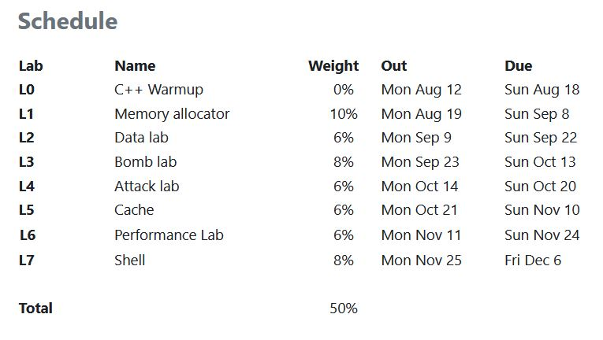

### Course Overview 
CS2011: Fundamentals of Computer Systems

Lecture #1

August 9, 2024
---
### Overview 
- **Introductions**
- **Big Picture**
	- Course theme
	- Five realities
	- How the course fits into your curriculum
- **Logistics and Policies**
- **Academic Integrity**
---
### Staff
- **Instructor**

	- Pankaj Pansari
- **Teaching Assistant**

	- Shivam Agarwal
	- Sachin Kumar
---
## The Big Picture
---
### Theme:
**(Systems) Knowledge is Power!**
- Systems Knowledge <!-- .element: class="fragment" -->
	- How hardware plus software combine to support the execution of application programs <!-- .element: class="fragment" -->
	- How you as a programmer can best use these resources <!-- .element: class="fragment" -->
- Useful outcomes from taking FoCS <!-- .element: class="fragment" -->
	- Become more effective programmers <!-- .element: class="fragment" -->
		- Able to find and eliminate bugs efficiently <!-- .element: class="fragment" -->
		- Able to understand and tune for program performance <!-- .element: class="fragment" -->
	- Prepare for later "systems" classes <!-- .element: class="fragment" -->
		- Compilers, Operating Systems, Networks, Computer Architecture, Embedded Systems, Storage Systems, etc. <!-- .element: class="fragment" -->
---
## Theme:
**It's Important to Understand How Things Work**
- Why do I need to know this stuff? <!-- .element: class="fragment" -->
	- Abstraction is good, but don't forget reality <!-- .element: class="fragment" -->
- Most CS and CE courses emphasize abstraction; so do we! <!-- .element: class="fragment" -->
	- Abstract data types <!-- .element: class="fragment" -->
	- Asymptotic analysis <!-- .element: class="fragment" -->
- But it's helpful to understand what abstractions build upon and their limits! <!-- .element: class="fragment" -->
	- Especially in the presence of bugs <!-- .element: class="fragment" -->
	- Need to understand details of underlying implementations <!-- .element: class="fragment" -->
	- Sometimes the abstract interfaces don't provide the level of control or performance you need <!-- .element: class="fragment" -->
---
## Reality #1:
**Ints are not Integers, Floats are not Reals**
- **Example 1: Is $ x^2 \geq 0? $** <!-- .element: class="fragment" -->
	- Floats: Yes! <!-- .element: class="fragment" -->
	- Ints:  <!-- .element: class="fragment" -->
		- $ 40000 * 40000 \rightarrow 1600000000 $ <!-- .element: class="fragment" -->
		- $ 50000 * 50000 \rightarrow ?? $ <!-- .element: class="fragment" -->

- **Example 2: Is $(x + y) + z = x + (y + z)$?** <!-- .element: class="fragment" -->
	- Unsigned & signed Ints: Yes! <!-- .element: class="fragment" -->
	- Floats: <!-- .element: class="fragment" -->
		- $(1\times 10^{20} + -1 \times 10^{20}) + 3.14 \rightarrow 3.14$ <!-- .element: class="fragment" -->
		- $1 \times 10^{20} + (-1 \times 10^{20} + 3.14) \rightarrow 0$ <!-- .element: class="fragment" -->
---
## Computer Arithmetic
- **Does not generate random values** <!-- .element: class="fragment" -->
	- Arithmetic operations have important mathematical properties <!-- .element: class="fragment" -->
- **Cannot assume all “usual” mathematical properties** <!-- .element: class="fragment" -->
	- Due to finiteness of representations <!-- .element: class="fragment" -->
	- Integer operations satisfy “ring” properties <!-- .element: class="fragment" -->
		- Commutativity, associativity, distributivity <!-- .element: class="fragment" -->
	- Floating point operations satisfy “ordering” properties <!-- .element: class="fragment" -->
		- Monotonicity, values of signs <!-- .element: class="fragment" -->
- **Observation** <!-- .element: class="fragment" -->
	- Need to understand which abstractions apply in which contexts <!-- .element: class="fragment" -->
	- Important issues for compiler writers and serious application programmers <!-- .element: class="fragment" -->
---
## Reality #2:
**You've Got to Know Assembly**
- **Chances are, you'll never write programs in assembly** <!-- .element: class="fragment" -->
- **But: Understanding assembly is key to machine-level execution model** <!-- .element: class="fragment" -->
	- Behavior of programs in presence of bugs <!-- .element: class="fragment" -->
		- High-level language models break down <!-- .element: class="fragment" -->
	- Tuning program performance <!-- .element: class="fragment" -->
		- Understand optimizations done / not done by the compiler <!-- .element: class="fragment" -->
		- Understanding sources of program inefficiency <!-- .element: class="fragment" -->
	- Implementing system software <!-- .element: class="fragment" -->
		- Compiler has machine code as target <!-- .element: class="fragment" -->
		- Operating systems must manage process state <!-- .element: class="fragment" -->
	- Creating / fighting malware <!-- .element: class="fragment" -->
		- x86 assembly is the language of choice! <!-- .element: class="fragment" -->
---
## Reality #3: 
**Memory Matters:**
- **Random Access Memory is an non-physical Abstraction** <!-- .element: class="fragment" -->
- **Memory is not unbounded** <!-- .element: class="fragment" -->
	- It must be allocated and managed <!-- .element: class="fragment" -->
	- Many applications are memory dominated <!-- .element: class="fragment" -->
- **Memory referencing bugs especially pernicious** <!-- .element: class="fragment" -->
	- Effects are distant in both time and space <!-- .element: class="fragment" -->
- **Memory performance is not uniform** <!-- .element: class="fragment" -->
	- Cache and virtual memory effects can greatly affect program performance <!-- .element: class="fragment" -->
	- Adapting program to characteristics of memory system can lead to major speed improvements <!-- .element: class="fragment" -->
---

<h2> Memory Referencing Bug </h2>

	<pre><code data-trim data-noescape data-line-numbers>
typedef struct {
  int a[2];
  double d;
} struct_t;

double fun(int i) {
  volatile struct_t s;
  s.d = 3.14;
  s.a[i] = 1073741824; /* Possibly out of bounds */
  return s.d;
}
  	</code></pre>

---

<h2> Memory Referencing Bug </h2>
<ul>
<li> Result is system specific </li>
</ul>

$\texttt{fun(0)} \rightarrow 3.14 \\
\texttt{fun(1)} \rightarrow 3.14 \\
\texttt{fun(2)} \rightarrow 3.1399998664856 \\
\texttt{fun(3)} \rightarrow 2.00000061035156 \\
\texttt{fun(4)} \rightarrow 3.14 \\
\texttt{fun(6)} \rightarrow \text{Segmentation fault}$ 

---

<h2> Memory Referencing Bug </h2>
Explanation

<pre><code data-trim data-noescape data-line-numbers>
typedef struct {
  int a[2];
  double d;
} struct_t;
</code></pre>

---
## Memory Referencing Errors
- **C and C++ do not provide any memory protection** <!-- .element: class="fragment" -->
	- Out of bounds array references <!-- .element: class="fragment" -->
	- Invalid pointer values <!-- .element: class="fragment" -->
	- Abuses of malloc/free <!-- .element: class="fragment" -->
- **Can lead to nasty bugs** <!-- .element: class="fragment" -->
	- Effect of bug depends on system and compiler <!-- .element: class="fragment" -->
	- Action at a distance <!-- .element: class="fragment" -->
		- Corrupted object logically unrelated to one being accessed <!-- .element: class="fragment" -->
		- Effect of bug may be first observed long after it is generated <!-- .element: class="fragment" -->
- **How can I deal with this?** <!-- .element: class="fragment" -->
	- Program in Java, Ruby, Python, ML, … <!-- .element: class="fragment" -->
	- Understand what possible interactions may occur <!-- .element: class="fragment" -->
	- Use or develop tools to detect referencing errors (e.g. Valgrind) <!-- .element: class="fragment" -->
---
## Great Reality #4:
**Asymptotic complexity is not everything**
- **Constant factors matter too!** <!-- .element: class="fragment" -->
- **And even exact op count does not predict performance** <!-- .element: class="fragment" -->
	- Easily see 10:1 performance range depending on implementatioin<!-- .element: class="fragment" -->
	- Must optimize at multiple levels: algorithm, data representations, procedures, and loops <!-- .element: class="fragment" -->
- **Must understand system to optimize performance** <!-- .element: class="fragment" -->
	- How programs compiled and executed <!-- .element: class="fragment" -->
	- How to measure program performance and identify bottlenecks <!-- .element: class="fragment" -->
	- How to improve performance without destroying code modularity and generality <!-- .element: class="fragment" -->
---
## Memory System Performance Example

	

		<pre><code data-trim data-noescape data-line-numbers>
void copyij(int src[2048][2048], 
           int dst[2048][2048])
{
    int i,j;
    for (i = 0; i < 2048; i++)
        for (j = 0; j < 2048; j++)
            dst[i][j] = src[i][j];
}
		</code></pre>
	

	

		<pre><code data-trim data-noescape data-line-numbers>
void copyji(int src[2048][2048], 
           int dst[2048][2048])
{
    int i,j;
    for (j = 0; j < 2048; j++)
        for (i = 0; i < 2048; i++)
            dst[i][j] = src[i][j];
}
		</code></pre>
	

4.3ms
	

81.8ms
	

2.0 GHz Intel Core i7 Haswell

	<ul class="fragment">
		<li><strong>Hierarchical memory organization</strong></li>
		<li><strong>Performance depends on access patterns</strong>
			<ul>
				<li>Including how step through multi-dimensional array</li>
			</ul>
		</li>
	</ul>

---
## We'll learn in class: Memory Hierarchy	

---
## Great Reality #5:
**Computers do more than execute programs** <!-- .element: class="fragment" -->
- **They need to get data in and out** <!-- .element: class="fragment" -->
	- I/O system critical to program reliability and performance <!-- .element: class="fragment" -->
- **They communicate with each other over networks** <!-- .element: class="fragment" -->
	- Many system-level issues arise in presence of network <!-- .element: class="fragment" -->
		- Concurrent operations by autonomous processes <!-- .element: class="fragment" -->
		- Coping with unreliable media <!-- .element: class="fragment" -->
		- Cross platform compatibility <!-- .element: class="fragment" -->
		- Complex performance issues <!-- .element: class="fragment" -->
---
## Course Perspective
- Most Systems Courses are Builder-Centric <!-- .element: class="fragment" -->
	- Computer Architecture <!-- .element: class="fragment" -->
		- Design pipelined processor in Verilog <!-- .element: class="fragment" -->
- Operating Systems <!-- .element: class="fragment" -->
	- Implement sample portions of operating system <!-- .element: class="fragment" -->
- Compilers <!-- .element: class="fragment" -->
	- Write compiler for simple language <!-- .element: class="fragment" -->
- Networking <!-- .element: class="fragment" -->
	- Implement and simulate network protocols <!-- .element: class="fragment" -->
---
## Course Perspective (Cont.) 
- **Our Course is Programmer-Centric** <!-- .element: class="fragment" -->
	- By knowing more about the underlying system, you can be more effective as a programmer <!-- .element: class="fragment" -->
	- Enable you to <!-- .element: class="fragment" -->
		- Write programs that are more reliable and efficient <!-- .element: class="fragment" -->
		- Incorporate features that require hooks into OS <!-- .element: class="fragment" -->
			- E.g., concurrency, signal handlers <!-- .element: class="fragment" -->
---
## Role Within Your Curriculum 
Underlying principles for hardware and software
 
---
## Logistics
---
## Primary Textbook
- Randal E. Bryant and David R. O'Hallaron,
	- *Computer Systems: A Programmer's Perspective*, Third Edition (CS:APP3e), Pearson, 2016
- https://csapp.cs.cmu.edu
- This book really matters for the course!
	- How to solve labs
	- Practice problems typical of exam problems
- 10 copies in Plaksha Library
- Come talk to us about it if you can't make it make sense
---
## Recommended reading
- **Brian Kernighan and Dennis Ritchie,**
    - *The C Programming Language*, Second Edition, Prentice Hall, 1988
    - Everyone calls this book "K&R"
    - Guide to C by the designers of the language
    - Well-written, concise
    - A little dated
        - Doesn’t cover additions to C since 1988
---
## Policies: Grading
- Final Exam (20%)
- Attendance (10%)
- Labs (50%): weighted according to effort
- Quizzes (20%): drop lowest 1 out of 6 
- Start-of-lecture quizzes are NOT graded
---
## Getting Help
- Find information on Moodle course page 
- Use Piazza
	- Remember you can ask questions anonymously
- Come to office hours
	- Faculty office hours
	- TA office hours
- 1:1 appointments
	- You can email any of the teaching staff to schedule 1:1 appointments
---
## Managing this course
- Time management is key
	- Start early.
	- Office hours likely to be empty the first few days an assignment is out.
- Read the Textbook!
- Come to lecture
- Come to tutorials
---
## Lab Assignments 
---
## Lab Rationale

- Labs (7)
	- The heart of the course
	- 1-3 weeks each
	- Provide in-depth understanding of an aspect of systems
	- Programming and measurement

- Each lab has a well-defined goal such as solving a puzzle

- Doing the lab should result in new skills and concepts
---
## Lab Schedule

---
## Timeliness
- Grace days
	- **5 grace days** for the semester
	- Limit of **2 grace days** per lab used **automatically**
	- Covers scheduling crunch, out-of-town trips, illnesses, minor setbacks
	- Save them until late in the term!
- Lateness penalties
	- Once grace day(s) used up, get penalized **15% per day**
	- No hand-ins later than **3 days after due date**
- Catastrophic events
	- Major illness, death in family, …
	- Formulate a plan (with your academic advisor) to get back on track
- Advice: Once you start running late, it’s really hard to catch up
---
## How to do well
- Start early
- Don’t rely on marathon programming sessions
	- Your brain works better in small bursts of activity
	- Ideas / solutions will come to mind while you’re doing other things
- Plan for stumbling blocks
- Assignment is harder than you expected
- Code doesn’t work
- Bugs hard to track down
- Life gets in the way
	- Minor health issues
	- Unanticipated events
- Reach out to the faculty! We will help you, give extensions, etc. My goal is for you to learn & succeed, not be cop.
---
## Version Control: Your Friend

- Labs will be distributed via GitHub Classroom
- Must be used by all students
- Students must commit early and often
- If a student is accused of cheating (plagiarism), we will consult the GIT server and look for a reasonable commit history
- Missing GIT history will count against you
- Note: Posting your work for this class in a public Git repo (on your personal GitHub account, for instance) is considered violation of academic integrity. 
	- You’re making it too easy for other people to copy from you
	- Use a private repo shared with specific people if you want to e.g. show your work to a potential employer
	
---
## Academic Integrity
---
## Cheating/Plagiarism: Description

- Unauthorized use of information
	- Borrowing code: by copying, retyping, looking at a file
	- Describing: verbal description of code from one person to another
	- Copying code from a previous course or online solution
	- Reusing your code from a previous semester (here or elsewhere)
		- If you take the course this semester, all work has to be done this semester (unless you have special permission from the instructors)
	- Using AI to generate your code (e.g., GitHub CoPilot)
---
## Cheating/Plagiarism: Description (cont.)
- Unauthorized supplying of information
	- Providing copy: Giving a copy of a file to someone
	- Providing access:
		- Putting material in unprotected directory
		- Putting material in unprotected code repository (e.g., Github)
	- Applies to this term and the future
- Collaborations beyond high-level, strategic advice
	- Anything more than block diagram or a few words
	- Code / pseudo-code is NOT high level
	- Code-level debugging is NOT high level
---
## Cheating: What It's Not
- Explaining how to use systems or tools
- Helping others with high-level design issues
-   High means VERY high
- Using code supplied by us
- Using code from the CS:APP web site
- Using books from the library, Unix manpages, other published material
- Using general online references
	- OK: The GNU C Library Manual, Beej’s Guide to C, cplusplus.com
	- Not OK: searching for “malloc solution”
---
## Cheating/Plagiarism: Attribution
- If you copy code (that you’re allowed to copy), you MUST credit the author
	- Starter code: No
	- Any other allowed code (course, CS:APP, etc): Yes
	- Indicate source, beginning, and end
---
## Cheating: Consequences	
- Penalty for cheating:
	- Best case: -100% for assignment
		- You would be better off to turn in nothing
	- Worst case: Report to Academic Office 
- Detection of cheating:
	- This semester we're using MOSS; it's a sophisticated tool for detecting code plagiarism
---
## Cheating: Examples
- This is Cheating:
	- Giving your code to someone else, now or in the future
	- Posting your code in a publicly accessible place on the Internet, now or in the future
- This is OK (and encouraged):
	- Googling a man page for fputs
	- Asking a friend for help with gdb
	- Asking a TA or course instructor for help, showing them your code, …
	- Looking in the textbook for a code example
	- Talking about a (high-level) approach to the lab with a classmate
---
## Why It’s a Big Deal

- This material is best learned by doing
	- Even though that can, at times, be difficult and frustrating
	- Starting with a copy of a program and then tweaking it is very different from writing from scratch
		- Planning, designing, organizing a program are important skills
- This is the gateway to other system courses
	- Want to make sure everyone completing the course has mastered the material
- Industry appreciates the value of this course
	- I want to make sure anyone claiming to have taken the course is prepared for the real world
- Working in teams and collaboration is an important skill
	- But only if team members have solid foundations
	- This course is about foundations, not teamwork
---